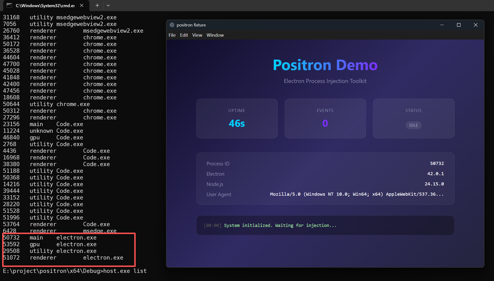
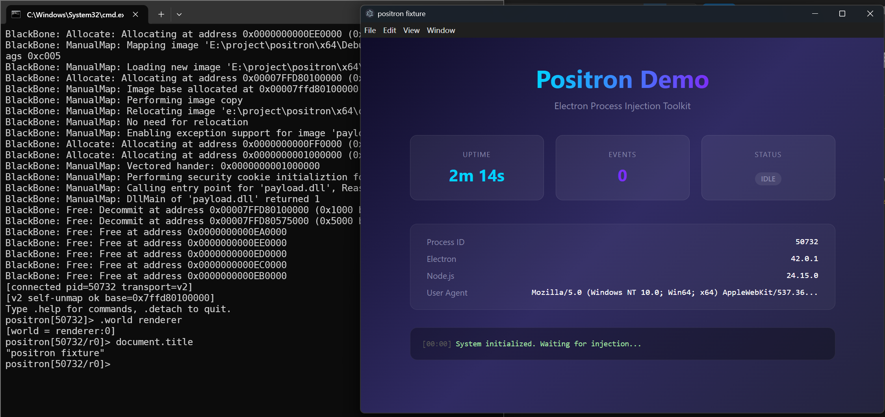
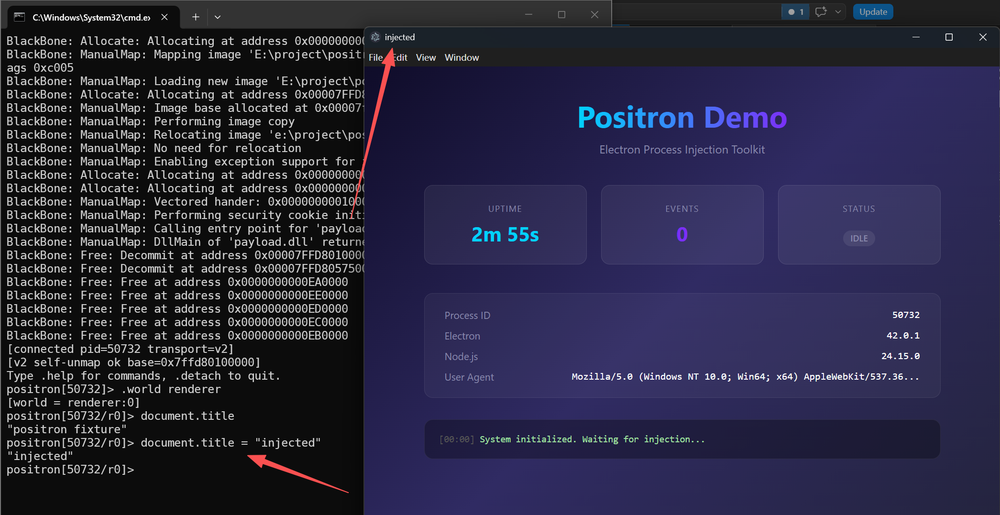
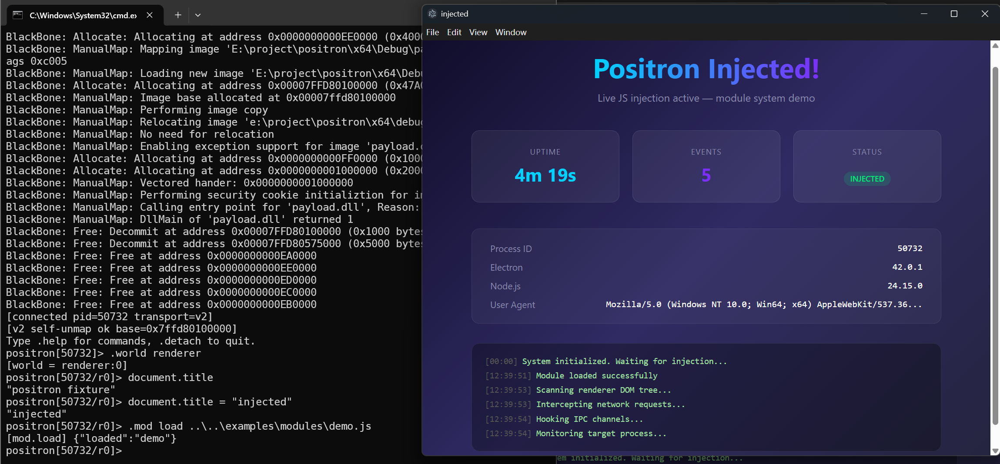

# Positron

> Windows 平台的 Electron 进程注入工具

[English](../README.md)

附加到任意运行中的 Electron 应用，在主进程或渲染进程中执行 JavaScript，并通过模块系统动态扩展功能——无需重启目标程序，无需修改源文件。


*进程列表 + 演示用的 fixture 应用*

## 特性

- **附加到运行中的进程** — 不重启、不改源码
- **主进程 / 渲染进程切换** — `.world renderer` 一键切换
- **模块系统** — 动态加载/卸载 JS 模块，完整生命周期管理
- **DLL 自卸载** — payload 注入 bootstrap 后从内存中彻底擦除
- **断线重连** — JS 服务在目标中持续运行，host 重启后无需重新注入
- **x64 / x86** 双架构支持
- **C++ SDK** — 静态库，方便集成到其他工具

## 快速开始

```bash
# 构建（需要 VS2022+ C++20, Node.js）
npm install
msbuild positron.slnx /p:Configuration=Debug /p:Platform=x64 /m

# 列出 Electron 进程
host.exe list

# 附加并进入 REPL
host.exe attach <pid>
```

## 工作原理

```
host.exe ──attach──> 目标进程 (Electron)
   │                    │
   │  1. 手动映射 payload.dll（BlackBone，绕过加载器签名校验）
   │  2. 模糊匹配 V8 导出符号
   │  3. 在 V8 主线程中启动 JS TCP 服务
   │  4. payload.dll 自卸载（移除 VEH + shellcode 跳板释放内存）
   │                    │
   │  5. 纯 JS 通信（TCP 长度前缀 + JSON）
   │                    │
   └────────────────────┘
```

bootstrap 完成后，原生 DLL 从内存中完全消失。后续 `host.exe attach` 检测到 JS 服务已存活，直接连接跳过注入。

## 使用方法

### 交互式 REPL


*附加目标、切换到渲染进程、读取 document.title*

```
host.exe attach <pid>

positron[pid]> 1+1
2
positron[pid]> process.versions.electron
"42.0.1"
positron[pid]> .world renderer
[world = renderer:0]
positron[pid/r0]> document.title
"Positron Demo"
```

### 实时 DOM 修改


*从 REPL 中修改页面标题*

```
positron[pid/r0]> document.title = "injected"
"injected"
```

### 模块系统


*加载 demo 模块后：标题变更、状态徽章切换、日志条目实时输出*

```
positron[pid]> .mod load examples\modules\demo.js
[mod.load] {"loaded":"demo"}
positron[pid]> .mod list
[modules] ["demo"]
positron[pid]> .mod unload demo
[mod.unload] {"unloaded":"demo"}
```

模块有完整的生命周期管理：

```js
(function() {
  return {
    name: 'my-module',
    onLoad: function(api) {
      api.evalRenderer('document.title', 0).then(function(t) {
        api.log('标题: ' + t);
      });
    },
    onUnload: function(api) {
      api.log('再见');
    }
  };
})()
```

**模块 API**：`api.eval()`、`api.evalRenderer()`、`api.send()`、`api.log()`、`api.getElectron()`、`api.require`

### 单次执行

```bash
host.exe eval <pid> "1+1"                  # 主进程
host.exe eval -r <pid> "document.title"    # 渲染进程
host.exe run <pid> script.js               # 执行 JS 文件
```

### 原生模式

需要挂钩原生导出函数时使用（DLL 保持映射）：

```bash
host.exe attach --native <pid>
positron(native)[pid]> .hook SomeExport
```

## REPL 命令

| 命令 | 说明 |
|---|---|
| `.world auto\|renderer[:N]` | 切换执行目标 |
| `.mod load <文件>` | 加载 JS 模块 |
| `.mod unload <名称>` | 卸载模块 |
| `.mod list` | 列出已加载模块 |
| `.dump [名称]` | 保存页面 HTML |
| `.hook <符号>` | （原生模式）安装 detour |
| `.detach` | 断开连接 |

## 项目结构

```
positron/
  host/           命令行工具 + REPL (host.exe)
  payload/        注入 DLL — V8 桥接、自卸载跳板
  sdk/            静态库、头文件、bootstrap.js（terser 压缩）
  shared/wire/    长度前缀 JSON 帧协议
  examples/       SDK 使用示例、JS 模块（demo、hello）
  tests/          集成测试 + 单元测试
  third_party/    依赖库（git submodule，见下方许可声明）
```

### 自卸载流程

JS 服务确认存活后：

1. 停止分离线程（渲染轮询器、hook 刷新器）
2. `RemoveVectoredExceptionHandler`（移除 BlackBone 的 VEH）
3. `VirtualFree` 释放 BlackBone 临时页面（约 12 KB）
4. 在独立 RWX 页上生成 shellcode 跳板：`Sleep(500ms)` → `VirtualFree(payload基址)` → `ExitThread(0)`

## SDK

```cpp
#include <positron/sdk.h>

positron::sdk::Session s;
s.attach(pid);               // 默认 v2 传输
auto r = s.eval("1+1");     // r.json_value == "2"
s.detach();
```

## 第三方依赖

所有依赖以 git submodule 形式包含在 `third_party/` 下。

| 库 | 许可 | 说明 |
|---|---|---|
| [BlackBone](https://github.com/DarthTon/Blackbone) | MIT | 手动 DLL 映射 |
| [MinHook](https://github.com/TsudaKageyu/minhook) | BSD-2-Clause | x64/x86 inline hook 引擎 |
| [nlohmann/json](https://github.com/nlohmann/json) | MIT | C++ JSON 库 |
| [CLI11](https://github.com/CLIUtils/CLI11) | BSD-3-Clause | 命令行解析 |
| [replxx](https://github.com/AmokHuginnsson/replxx) | BSD-3-Clause | 交互式 REPL 行编辑 |
| [doctest](https://github.com/doctest/doctest) | MIT | C++ 测试框架 |

克隆后初始化 submodule 并应用补丁：
```bash
git submodule update --init --recursive
# 应用本地补丁（BlackBone 工具集 + API getter）
cd third_party/Blackbone && git apply ../../patches/blackbone.patch && cd ../..
# 或 Windows PowerShell：
powershell -File patches/apply.ps1
```

## 许可

[MIT](../LICENSE)
